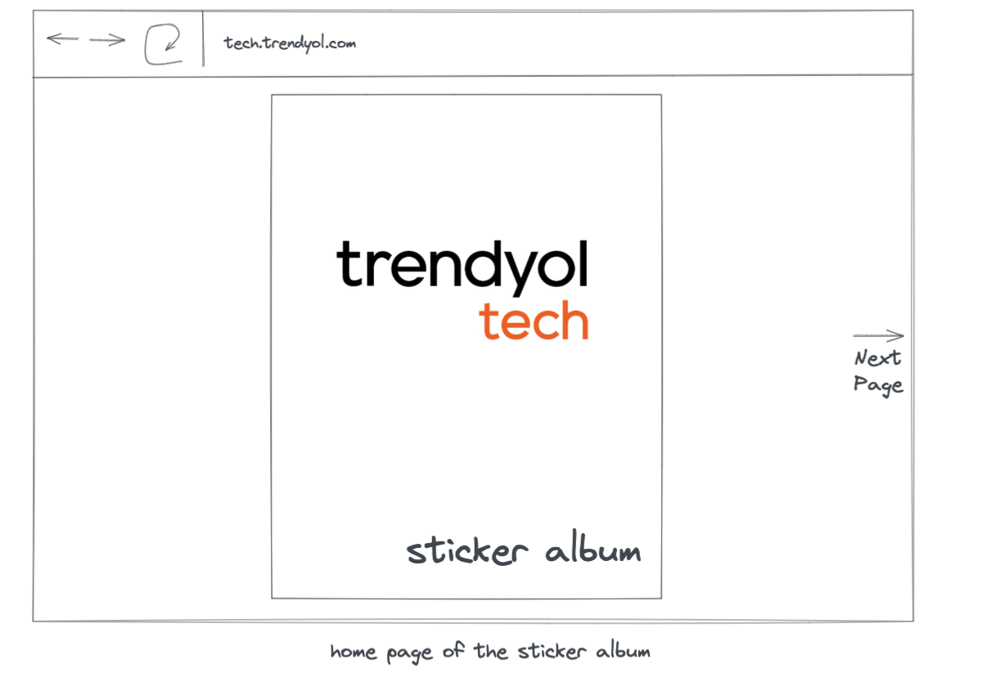
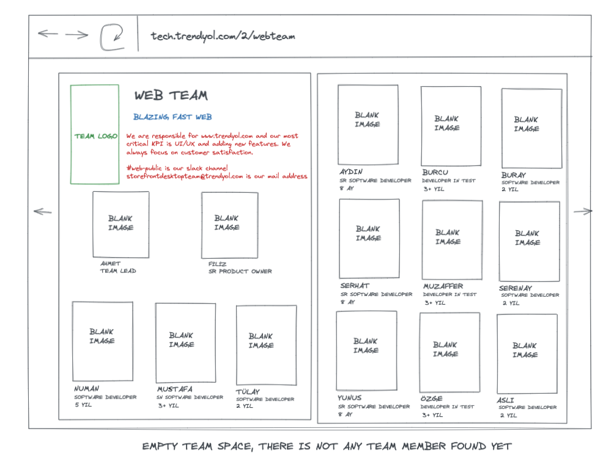
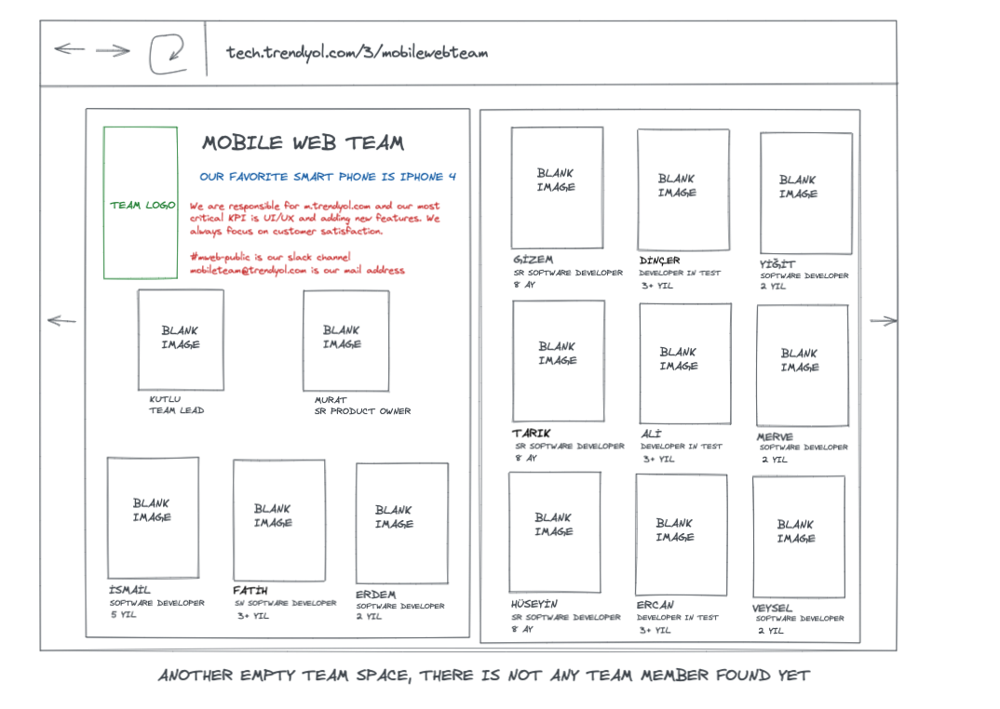
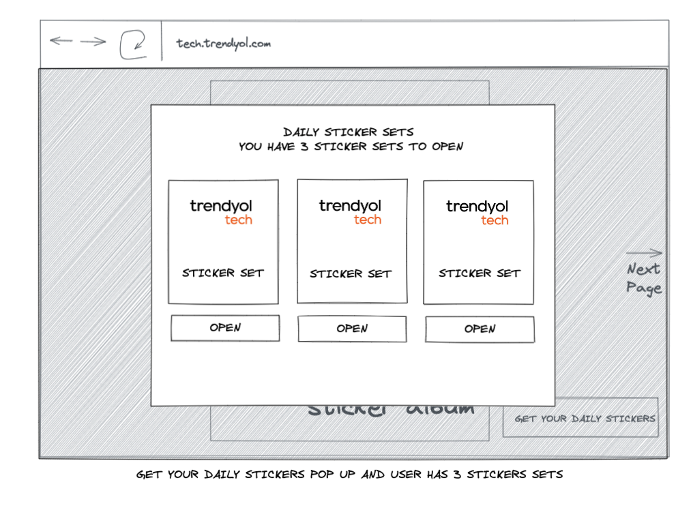
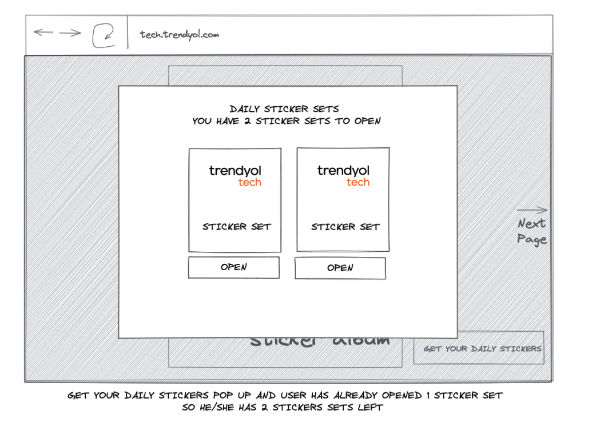
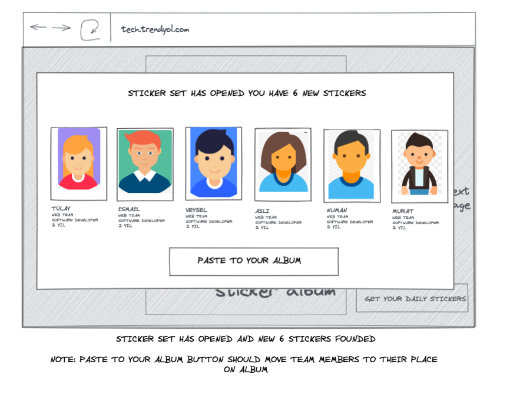
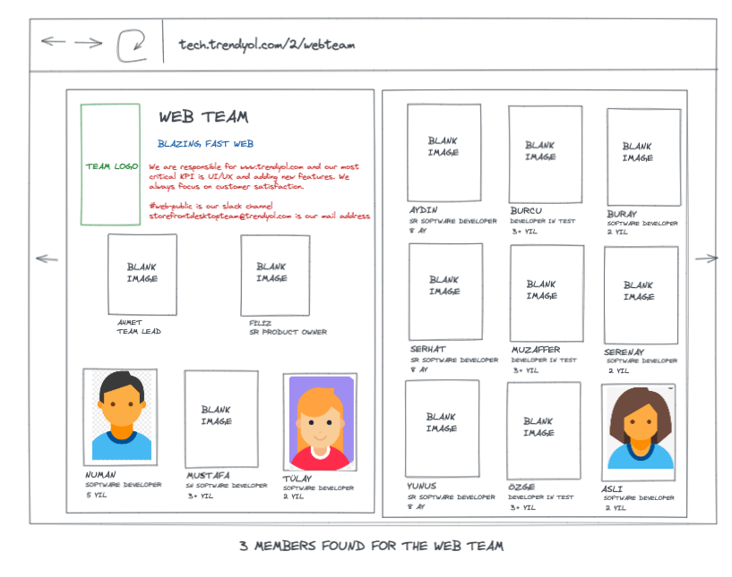
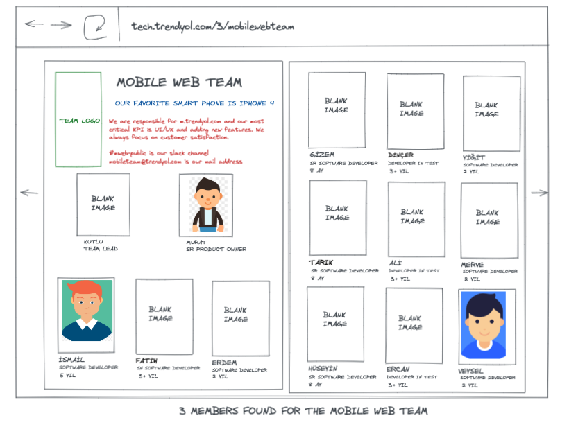

# Getting Started with Create React App

This project was bootstrapped with [Create React App](https://github.com/facebook/create-react-app).

## Available Scripts

In the project directory, you can run:

### `npm start`

Runs the app in the development mode.\
Open [http://localhost:3000](http://localhost:3000) to view it in the browser.

The page will reload if you make edits.\
You will also see any lint errors in the console.

### `npm test`

Launches the test runner in the interactive watch mode.\
See the section about [running tests](https://facebook.github.io/create-react-app/docs/running-tests) for more information.

### `npm run test-coverage`

Launches the test runner in the interactive watch mode.\
And it creates the test coverage files.

### `npm run prettier`

Prettifies the files.

### `npm run build`

Builds the app for production to the `build` folder.\
It correctly bundles React in production mode and optimizes the build for the best performance.

The build is minified and the filenames include the hashes.\
Your app is ready to be deployed!

See the section about [deployment](https://facebook.github.io/create-react-app/docs/deployment) for more information.

### `npm run eject`

**Note: this is a one-way operation. Once you `eject`, you can’t go back!**

If you aren’t satisfied with the build tool and configuration choices, you can `eject` at any time. This command will remove the single build dependency from your project.

Instead, it will copy all the configuration files and the transitive dependencies (webpack, Babel, ESLint, etc) right into your project so you have full control over them. All of the commands except `eject` will still work, but they will point to the copied scripts so you can tweak them. At this point you’re on your own.

You don’t have to ever use `eject`. The curated feature set is suitable for small and middle deployments, and you shouldn’t feel obligated to use this feature. However we understand that this tool wouldn’t be useful if you couldn’t customize it when you are ready for it.

## Learn More

You can learn more in the [Create React App documentation](https://facebook.github.io/create-react-app/docs/getting-started).

To learn React, check out the [React documentation](https://reactjs.org/).

<h1 align="left"> Team Sticker Album </h1>

<h3 align="left"> About Case </h3>

You are working in a technology department with 1200 people. The Tech department has 120 scrum teams. Since teams work remotely, nobody knows each other.

You have a great idea to solve communication problems. You will create an online sticker album so that teams can get familiar with each other.

<h3 align="left"> Acceptance Criteria </h3>

- Each team in the department should have its own section
- A person can open only 3 sticker sets in a day
- Each sticker set has 6 stickers
- Clean code and readable folder structure
- You can use any tech stack which you feel comfortable
- You do not need a backend code, you can use Json File or in memory database to manage teams and team members

<h3 align="left"> Expectations </h3>

Your teammates are waiting for a POC from you. Below you can see the images for the first design. You can implement your layout with your own UX.

<h3 align="left"> Nice to have </h3>

- Bug free and 100% unit test coverage
- Well designed UX supported with CSS Animations
- An online demo
- Well documented product
- Well performanced client side library

## Follow us!

[Trendyol Tech Medium](https://medium.com/trendyol-tech)

[Trendyol Open Source GitHub](https://github.com/Trendyol)

[Trendyol Tech Youtube](https://www.youtube.com/channel/UCUBiayLMggBAsiYvGLzQJ5w)

[Trendyol Tech Kommunity](https://kommunity.com/@trendyol)